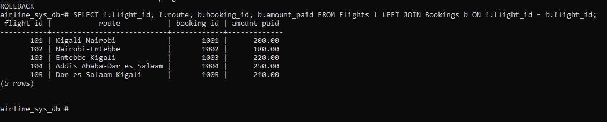
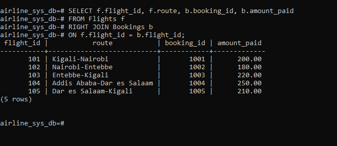

# Airline SQL Analysis Project

## Step 1: Problem Definition

**Business Context:**  
A regional airline operates flights across multiple destinations. The company manages customer bookings, flight schedules, and ticket sales.  

**Data Challenge:**  
The airline struggles to identify which routes generate the most revenue, track passenger booking frequency, and measure growth trends over time. Without clear insights, management cannot optimize pricing, promotions, or resource allocation.  

**Expected Outcome:**  
The analysis should reveal top-performing routes, customer segmentation by travel frequency, and monthly revenue trends. These insights will guide decisions on marketing strategies, loyalty programs, and operational improvements.

## Step 2: Success Criteria

The project will achieve the following five measurable goals using SQL Window Functions:

1. **Top 5 routes by revenue (RANK):**  
   Identify the five most profitable flight routes per quarter using `RANK()`.

2. **Running monthly revenue totals (SUM OVER):**  
   Calculate cumulative ticket sales month by month using `SUM() OVER()`.

3. **Month-over-month growth (LAG/LEAD):**  
   Compare revenue between consecutive months using `LAG()` and `LEAD()`.

4. **Passenger quartile segmentation (NTILE):**  
   Segment customers into four groups based on total bookings using `NTILE(4)`.

5. **Three-month moving average (AVG OVER):**  
   Compute rolling averages of revenue across three months using `AVG() OVER()`.

## Step 3: Database Schema Design

The airline database schema consists of five related tables:

### Customers
- customer_id (PK)
- name
- region
- email

### Flights
- flight_id (PK)
- route
- departure_date
- ticket_price
- departure_airport_id (FK → Airports.airport_id)
- arrival_airport_id (FK → Airports.airport_id)

### Bookings
- booking_id (PK)
- customer_id (FK → Customers.customer_id)
- flight_id (FK → Flights.flight_id)
- booking_date
- amount_paid

### Airports
- airport_id (PK)
- name
- city
- country

### Employees
- employee_id (PK)
- 1st_name
- 2nd_name
- role
-  assignment_flight_id (FK)

## Assignment

- assignment_id (PK)
- employee_id (FK → Employees.employee_id)
- flight_id (FK → Flights.flight_id)
### ER Diagram

**Verification:**
Below is the screenshot showing all tables created in the database:

Step 4: SQL JOIN Queries

## INNER JOIN 

**Result:**

## LEFT JOIN

**Result:**

## RIGHT JOIN

**Result:**

## FULL OUTER JOIN

**Result:**

