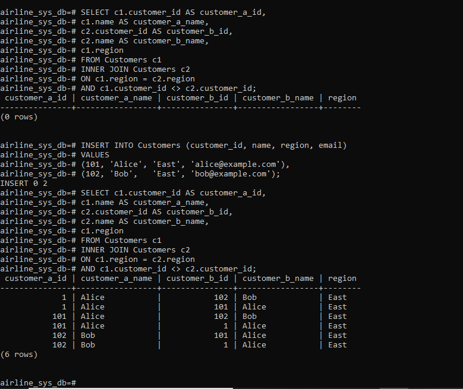
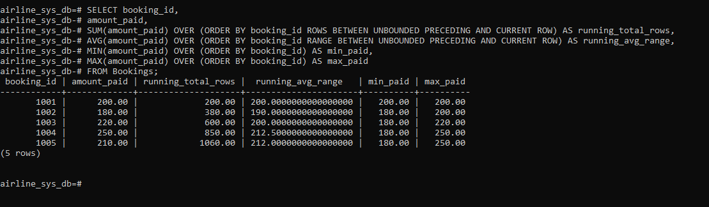
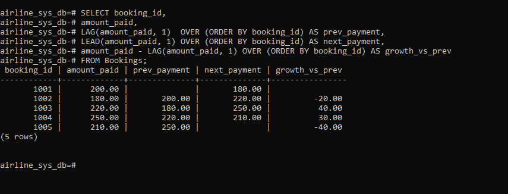

# Airline SQL Analysis Project

## Step 1: Problem Definition

**Business Context:**  
A regional airline operates flights across multiple destinations. The company manages customer bookings, flight schedules, and ticket sales.  

**Data Challenge:**  
The airline struggles to identify which routes generate the most revenue, track passenger booking frequency, and measure growth trends over time. Without clear insights, management cannot optimize pricing, promotions, or resource allocation.  

**Expected Outcome:**  
The analysis should reveal top-performing routes, customer segmentation by travel frequency, and monthly revenue trends. These insights will guide decisions on marketing strategies, loyalty programs, and operational improvements.

## Step 2: Success Criteria

The project will achieve the following five measurable goals using SQL Window Functions:

1. **Top 5 routes by revenue (RANK):**  
   Identify the five most profitable flight routes per quarter using `RANK()`.

2. **Running monthly revenue totals (SUM OVER):**  
   Calculate cumulative ticket sales month by month using `SUM() OVER()`.

3. **Month-over-month growth (LAG/LEAD):**  
   Compare revenue between consecutive months using `LAG()` and `LEAD()`.

4. **Passenger quartile segmentation (NTILE):**  
   Segment customers into four groups based on total bookings using `NTILE(4)`.

5. **Three-month moving average (AVG OVER):**  
   Compute rolling averages of revenue across three months using `AVG() OVER()`.

## Step 3: Database Schema Design

The airline database schema consists of five related tables:

### Customers
- customer_id (PK)
- name
- region
- email

### Flights
- flight_id (PK)
- route
- departure_date
- ticket_price
- departure_airport_id (FK → Airports.airport_id)
- arrival_airport_id (FK → Airports.airport_id)

### Bookings
- booking_id (PK)
- customer_id (FK → Customers.customer_id)
- flight_id (FK → Flights.flight_id)
- booking_date
- amount_paid

### Airports
- airport_id (PK)
- name
- city
- country

### Employees
- employee_id (PK)
- 1st_name
- 2nd_name
- role
-  assignment_flight_id (FK)

## Assignment

- assignment_id (PK)
- employee_id (FK → Employees.employee_id)
- flight_id (FK → Flights.flight_id)
### ER Diagram

**Verification:**
Below is the screenshot showing all tables created in the database:

Step 4: SQL JOIN Queries

## INNER JOIN 

**Result:**

## LEFT JOIN

**Result:**

## RIGHT JOIN

**Result:**

## FULL OUTER JOIN

**Result:**

## SELF JOIN

**Result:**

Note: Initially, our Customers table did not contain multiple customers sharing the same region.
To demonstrate the SELF JOIN query, we inserted two sample customers (Alice and Bob) with the same region value.
This allowed the query to return meaningful results, showing how pairs of customers can be matched when they share a region.

STEP 5:Window Functions Implementation

## RANKING

-- Ranking Functions: ROW_NUMBER, RANK, DENSE_RANK, PERCENT_RANK
SELECT customer_id,
SUM(amount_paid) AS total_revenue,
ROW_NUMBER() OVER (ORDER BY SUM(amount_paid) DESC) AS row_num,
RANK() OVER (ORDER BY SUM(amount_paid) DESC) AS rank,
DENSE_RANK() OVER (ORDER BY SUM(amount_paid) DESC) AS dense_rank,
PERCENT_RANK() OVER (ORDER BY SUM(amount_paid) DESC) AS percent_rank
FROM Bookings
GROUP BY customer_id;

Interpretation:  
This query ranks customers by revenue. ROW_NUMBER assigns a unique sequence, RANK allows ties, DENSE_RANK avoids gaps, and PERCENT_RANK shows relative standing. Useful for identifying top customers.

## Aggregate Window Functions

-- Aggregate Window Functions: SUM, AVG, MIN, MAX with ROWS and RANGE
SELECT booking_id,
amount_paid,
SUM(amount_paid) OVER (ORDER BY booking_id ROWS BETWEEN UNBOUNDED PRECEDING AND CURRENT ROW) AS running_total_rows,
AVG(amount_paid) OVER (ORDER BY booking_id RANGE BETWEEN UNBOUNDED PRECEDING AND CURRENT ROW) AS running_avg_range,
MIN(amount_paid) OVER (ORDER BY booking_id) AS min_paid,
MAX(amount_paid) OVER (ORDER BY booking_id) AS max_paid
FROM Bookings;

Interpretation:  
This query calculates running totals and averages across bookings. ROWS uses physical row boundaries, while RANGE uses value ranges. It helps track payment trends over time.

## Navigation Functions

-- Navigation Functions: LAG and LEAD
SELECT booking_id,
amount_paid,
LAG(amount_paid, 1)  OVER (ORDER BY booking_id) AS prev_payment,
LEAD(amount_paid, 1) OVER (ORDER BY booking_id) AS next_payment,
amount_paid - LAG(amount_paid, 1) OVER (ORDER BY booking_id) AS growth_vs_prev
FROM Bookings;

Interpretation:  
LAG looks back, LEAD looks forward. This query compares each booking’s payment to the previous one, showing growth or decline. Useful for analyzing customer spending changes.

## Distribution Functions

-- Distribution Functions: NTILE and CUME_DIST
SELECT customer_id,
SUM(amount_paid) AS total_revenue,
NTILE(4) OVER (ORDER BY SUM(amount_paid) DESC) AS quartile,
CUME_DIST() OVER (ORDER BY SUM(amount_paid) DESC) AS cumulative_distribution
FROM Bookings
GROUP BY customer_id;

Interpretation:  
NTILE(4) divides customers into quartiles based on revenue. CUME_DIST shows the proportion of customers below or equal to a given revenue. This helps segment customers into tiers.
